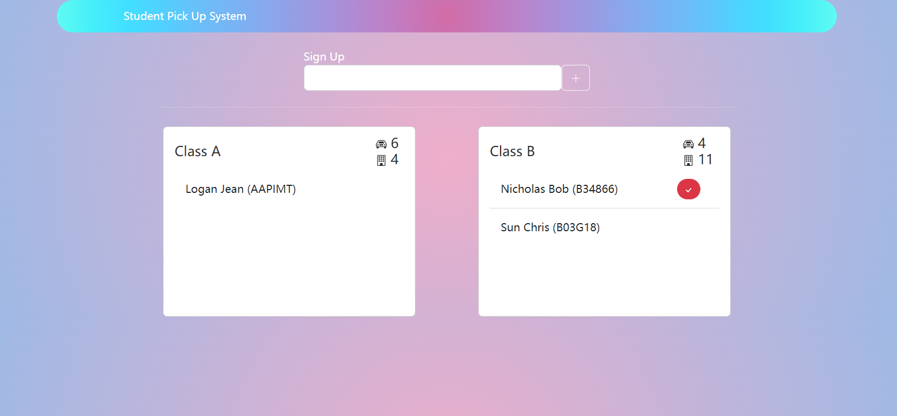
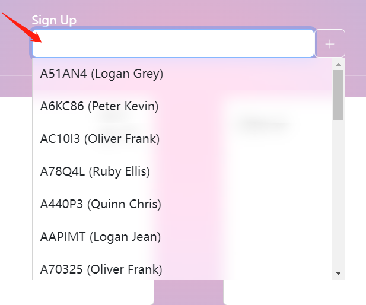
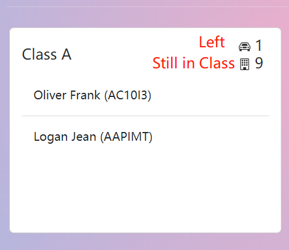
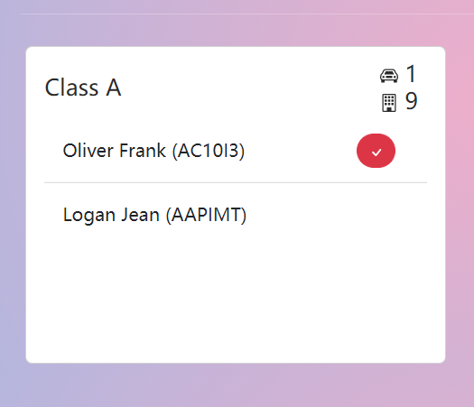

# KidPicKup
 Mini-project: Student Pick Up System

 [http://44.212.10.52:8000/](http://44.212.10.52:8000/)




## Environment Setup

This project is implemented in Python 3.8, Django REST framework and WebSockets. The backend storage is SQLite.

Dependencies:
```
django==4.1.3
djangorestframework==3.14.0
channels==3.0.5
```

## Deployment

### Local (localhost:8000)
```
python manage.py runserver
```

### Cloud (public_ip:8000)
```
screen
python3 manage.py runserver 0:8000
```
Then detach the screen with Ctrl + a + d
```
[detached from 31669.pts-0.ip-172-31-4-105]
```

## Data Ingestion
Student and Vehicle data are generated in a random process via the script [./insertData.py](insertData.py). However, the result is deterministic due to seeding.

The result dataset can be previewd in [./data.txt](data.txt)

## Data Reset For Testing Purposes
Because the operations in this project are irrevocable, a backdoor is provided to reset the dataset back to its initial state. Add "/reset" at the end of the url. (e.g. public_ip:8000/reset)

## Usage Guide
1. Enter Car Registration Number 
    
    User should enter an alphanumeric string of length 6 inside the sign-up bar. If an associated student is matched, his/her name will be added to the corresponding class dynamically.

    Autocompletion is implemented merely for the ease of testing inputs. To disable this feature, just remove the "autocomplete" class attribute from the input tag in [index.html](app/templates/index.html)

    

2. Read the Counters

    

3. Mark a Student as Left

    Hover on the student and a button will be displayed. Click the button to mark it as left. The student will be removed from the class dynamically.

    